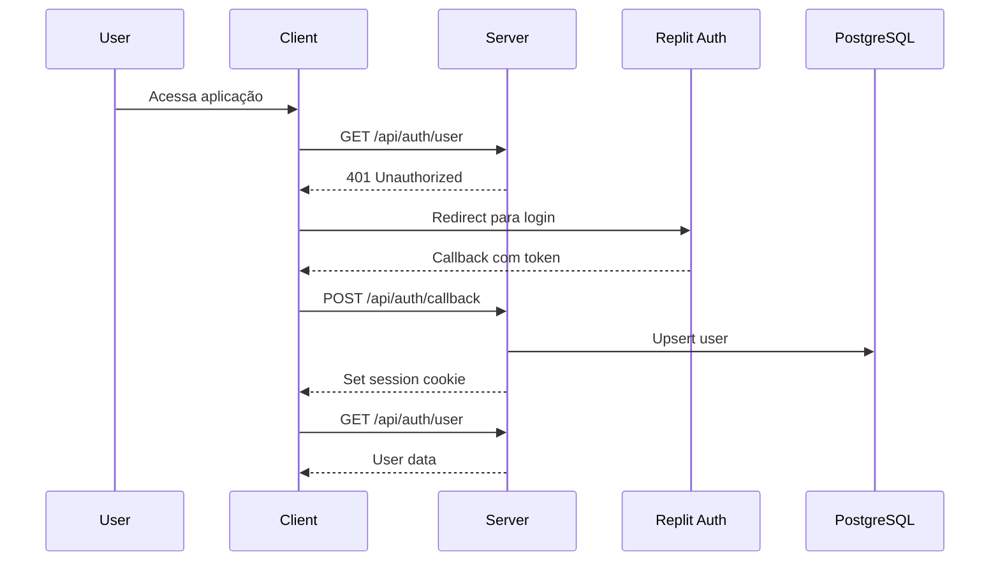
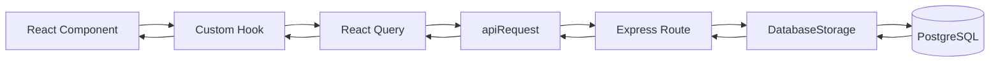

# Architecture Notes

Describe how the system is assembled and why the current design exists.

## System Architecture Overview

PrimeCloudProV2 é uma aplicação **monolítica modular** organizada em um **monorepo** com três camadas principais: `client/`, `server/` e `shared/`.

### Topologia

```
┌─────────────────────────────────────────────────────────────────┐
│                         Cliente (Browser)                        │
│                     React SPA + React Query                      │
└─────────────────────────────────────────────────────────────────┘
                                │
                                │ HTTP/REST (JSON)
                                ▼
┌─────────────────────────────────────────────────────────────────┐
│                        Servidor Express                          │
│   ┌──────────────┐  ┌──────────────┐  ┌──────────────────────┐  │
│   │    Routes    │→ │   Storage    │→ │    PostgreSQL DB     │  │
│   │  (routes.ts) │  │ (storage.ts) │  │    (Drizzle ORM)     │  │
│   └──────────────┘  └──────────────┘  └──────────────────────┘  │
│           │                                                      │
│           ▼                                                      │
│   ┌──────────────┐  ┌──────────────┐                            │
│   │   Services   │  │     Auth     │                            │
│   │  (email.ts)  │  │  (Passport)  │                            │
│   └──────────────┘  └──────────────┘                            │
└─────────────────────────────────────────────────────────────────┘
```

### Fluxo de Requisições

1. **Cliente → Servidor**: Requisições HTTP via `fetch` encapsulado em `apiRequest()` do React Query
2. **Servidor → Storage**: Routes delegam operações CRUD para a classe `DatabaseStorage`
3. **Storage → Database**: Drizzle ORM executa queries tipadas no PostgreSQL
4. **Servidor → Cliente**: Respostas JSON com tipos inferidos dos schemas Zod compartilhados

### Modelo de Deployment

- **Ambiente**: Replit com autoscale
- **Build**: Vite (frontend) + esbuild (backend) → `dist/`
- **Servidor**: Node.js 20 servindo SPA estática + API REST na porta 5000

## Architectural Layers

O sistema segue uma arquitetura em camadas com separação clara de responsabilidades:

| Camada | Responsabilidade | Localização |
|--------|------------------|-------------|
| **Models** | Definição de tipos e schemas de dados | `shared/schema.ts`, `shared/models/` |
| **Controllers** | Roteamento e handling de requisições | `server/routes.ts` |
| **Services** | Lógica de negócio e integrações | `server/services/` |
| **Storage** | Persistência e acesso a dados | `server/storage.ts` |
| **Components** | Interface do usuário | `client/src/components/`, `client/src/pages/` |
| **Hooks** | Data fetching e estado | `client/src/hooks/` |

### Models
Data structures and domain objects
- **Directories**: `shared`, `shared\models`
- **Symbols**: 32 total, 32 exported → depends on: Controllers
- **Key exports**:
  - [`LifecycleRule`](shared\schema.ts#L357) (type)
  - [`Product`](shared\schema.ts#L369) (type)
  - [`Order`](shared\schema.ts#L370) (type)
  - [`Account`](shared\schema.ts#L371) (type)
  - [`AccountMember`](shared\schema.ts#L372) (type)
  - [`Subscription`](shared\schema.ts#L373) (type)
  - [`Bucket`](shared\schema.ts#L374) (type)
  - [`AccessKey`](shared\schema.ts#L375) (type)
  - [`Notification`](shared\schema.ts#L376) (type)
  - [`AuditLog`](shared\schema.ts#L377) (type)
  - [`Invitation`](shared\schema.ts#L378) (type)
  - [`Invoice`](shared\schema.ts#L379) (type)
  - [`UsageRecord`](shared\schema.ts#L380) (type)
  - [`QuotaRequest`](shared\schema.ts#L381) (type)
  - [`SftpCredential`](shared\schema.ts#L382) (type)
  - [`CreateAccountRequest`](shared\schema.ts#L384) (type)
  - [`UpdateAccountRequest`](shared\schema.ts#L385) (type)
  - [`CreateMemberRequest`](shared\schema.ts#L386) (type)
  - [`CreateBucketRequest`](shared\schema.ts#L387) (type)
  - [`CreateAccessKeyRequest`](shared\schema.ts#L388) (type)
  - [`CreateNotificationRequest`](shared\schema.ts#L389) (type)
  - [`CreateAuditLogRequest`](shared\schema.ts#L390) (type)
  - [`CreateInvitationRequest`](shared\schema.ts#L391) (type)
  - [`CreateInvoiceRequest`](shared\schema.ts#L392) (type)
  - [`CreateUsageRecordRequest`](shared\schema.ts#L393) (type)
  - [`CreateQuotaRequestRequest`](shared\schema.ts#L394) (type)
  - [`CreateOrderRequest`](shared\schema.ts#L395) (type)
  - [`UpdateOrderRequest`](shared\schema.ts#L396) (type)
  - [`OrderWithDetails`](shared\schema.ts#L399) (interface)
  - [`AccountWithDetails`](shared\schema.ts#L405) (interface)
  - [`UpsertUser`](shared\models\auth.ts#L28) (type)
  - [`User`](shared\models\auth.ts#L29) (type)

### Controllers
Request handling and routing
- **Directories**: `shared`, `server`, `server\replit_integrations\auth`, `client\src\pages`
- **Symbols**: 2 total, 2 exported
- **Key exports**:
  - [`buildUrl`](shared\routes.ts#L401) (function)
  - [`registerAuthRoutes`](server\replit_integrations\auth\routes.ts#L6) (function)

### Services
Business logic and orchestration
- **Directories**: `server\services`
- **Symbols**: 6 total, 6 exported
- **Key exports**:
  - [`EmailOptions`](server\services\email.ts#L25) (interface)
  - [`sendEmail`](server\services\email.ts#L38) (function)
  - [`sendInvitationEmail`](server\services\email.ts#L70) (function)
  - [`sendVerificationEmail`](server\services\email.ts#L131) (function)
  - [`sendWelcomeEmail`](server\services\email.ts#L184) (function)
  - [`sendPasswordResetEmail`](server\services\email.ts#L245) (function)

### Utils
Shared utilities and helpers
- **Directories**: `server\lib`, `client\src\lib`
- **Symbols**: 15 total, 13 exported
- **Key exports**:
  - [`isValidCPF`](server\lib\document-validation.ts#L1) (function)
  - [`isValidCNPJ`](server\lib\document-validation.ts#L27) (function)
  - [`validateDocument`](server\lib\document-validation.ts#L55) (function)
  - [`cn`](client\src\lib\utils.ts#L4) (function)
  - [`apiRequest`](client\src\lib\queryClient.ts#L10) (function)
  - [`isValidCPF`](client\src\lib\document-validation.ts#L1) (function)
  - [`isValidCNPJ`](client\src\lib\document-validation.ts#L27) (function)
  - [`formatCPF`](client\src\lib\document-validation.ts#L55) (function)
  - [`formatCNPJ`](client\src\lib\document-validation.ts#L63) (function)
  - [`formatDocument`](client\src\lib\document-validation.ts#L72) (function)
  - [`validateDocument`](client\src\lib\document-validation.ts#L76) (function)
  - [`isUnauthorizedError`](client\src\lib\auth-utils.ts#L1) (function)
  - [`redirectToLogin`](client\src\lib\auth-utils.ts#L6) (function)

### Components
UI components and views
- **Directories**: `client\src\pages`, `client\src\components`, `client\src\components\ui`
- **Symbols**: 33 total, 7 exported
- **Key exports**:
  - [`NotFound`](client\src\pages\not-found.tsx#L4) (function)
  - [`Dashboard`](client\src\pages\Dashboard.tsx#L32) (function)
  - [`ButtonProps`](client\src\components\ui-custom.tsx#L10) (interface)
  - [`ChartConfig`](client\src\components\ui\chart.tsx#L11) (type)
  - [`CalendarProps`](client\src\components\ui\calendar.tsx#L8) (type)
  - [`ButtonProps`](client\src\components\ui\button.tsx#L42) (interface)
  - [`BadgeProps`](client\src\components\ui\badge.tsx#L28) (interface)


## Detected Design Patterns
- *No design patterns detected yet.*

## Entry Points
- [`server\index.ts`](server\index.ts)
- [`server\replit_integrations\auth\index.ts`](server\replit_integrations\auth\index.ts)
- [`client\src\main.tsx`](client\src\main.tsx)

## Public API
| Symbol | Type | Location |
| --- | --- | --- |
| [`AccessKey`](shared\schema.ts#L375) | type | shared\schema.ts:375 |
| [`Account`](shared\schema.ts#L371) | type | shared\schema.ts:371 |
| [`AccountMember`](shared\schema.ts#L372) | type | shared\schema.ts:372 |
| [`AccountWithDetails`](shared\schema.ts#L405) | interface | shared\schema.ts:405 |
| [`apiRequest`](client\src\lib\queryClient.ts#L10) | function | client\src\lib\queryClient.ts:10 |
| [`AuditLog`](shared\schema.ts#L377) | type | shared\schema.ts:377 |
| [`AuditLog`](client\src\hooks\use-audit-logs.ts#L3) | interface | client\src\hooks\use-audit-logs.ts:3 |
| [`BadgeProps`](client\src\components\ui\badge.tsx#L28) | interface | client\src\components\ui\badge.tsx:28 |
| [`Bucket`](shared\schema.ts#L374) | type | shared\schema.ts:374 |
| [`buildUrl`](shared\routes.ts#L401) | function | shared\routes.ts:401 |
| [`ButtonProps`](client\src\components\ui-custom.tsx#L10) | interface | client\src\components\ui-custom.tsx:10 |
| [`ButtonProps`](client\src\components\ui\button.tsx#L42) | interface | client\src\components\ui\button.tsx:42 |
| [`CalendarProps`](client\src\components\ui\calendar.tsx#L8) | type | client\src\components\ui\calendar.tsx:8 |
| [`ChartConfig`](client\src\components\ui\chart.tsx#L11) | type | client\src\components\ui\chart.tsx:11 |
| [`cn`](client\src\lib\utils.ts#L4) | function | client\src\lib\utils.ts:4 |
| [`CreateAccessKeyRequest`](shared\schema.ts#L388) | type | shared\schema.ts:388 |
| [`CreateAccountRequest`](shared\schema.ts#L384) | type | shared\schema.ts:384 |
| [`CreateAuditLogRequest`](shared\schema.ts#L390) | type | shared\schema.ts:390 |
| [`CreateBucketRequest`](shared\schema.ts#L387) | type | shared\schema.ts:387 |
| [`CreateInvitationRequest`](shared\schema.ts#L391) | type | shared\schema.ts:391 |
| [`CreateInvoiceRequest`](shared\schema.ts#L392) | type | shared\schema.ts:392 |
| [`CreateMemberRequest`](shared\schema.ts#L386) | type | shared\schema.ts:386 |
| [`CreateNotificationRequest`](shared\schema.ts#L389) | type | shared\schema.ts:389 |
| [`CreateOrderRequest`](shared\schema.ts#L395) | type | shared\schema.ts:395 |
| [`CreateQuotaRequestRequest`](shared\schema.ts#L394) | type | shared\schema.ts:394 |
| [`CreateUsageRecordRequest`](shared\schema.ts#L393) | type | shared\schema.ts:393 |
| [`Dashboard`](client\src\pages\Dashboard.tsx#L32) | function | client\src\pages\Dashboard.tsx:32 |
| [`DatabaseStorage`](server\storage.ts#L105) | class | server\storage.ts:105 |
| [`EmailOptions`](server\services\email.ts#L25) | interface | server\services\email.ts:25 |
| [`formatCNPJ`](client\src\lib\document-validation.ts#L63) | function | client\src\lib\document-validation.ts:63 |
| [`formatCPF`](client\src\lib\document-validation.ts#L55) | function | client\src\lib\document-validation.ts:55 |
| [`formatDocument`](client\src\lib\document-validation.ts#L72) | function | client\src\lib\document-validation.ts:72 |
| [`getSession`](server\replit_integrations\auth\replitAuth.ts#L21) | function | server\replit_integrations\auth\replitAuth.ts:21 |
| [`IAuthStorage`](server\replit_integrations\auth\storage.ts#L7) | interface | server\replit_integrations\auth\storage.ts:7 |
| [`Invitation`](shared\schema.ts#L378) | type | shared\schema.ts:378 |
| [`Invoice`](shared\schema.ts#L379) | type | shared\schema.ts:379 |
| [`IStorage`](server\storage.ts#L12) | interface | server\storage.ts:12 |
| [`isUnauthorizedError`](client\src\lib\auth-utils.ts#L1) | function | client\src\lib\auth-utils.ts:1 |
| [`isValidCNPJ`](server\lib\document-validation.ts#L27) | function | server\lib\document-validation.ts:27 |
| [`isValidCNPJ`](client\src\lib\document-validation.ts#L27) | function | client\src\lib\document-validation.ts:27 |
| [`isValidCPF`](server\lib\document-validation.ts#L1) | function | server\lib\document-validation.ts:1 |
| [`isValidCPF`](client\src\lib\document-validation.ts#L1) | function | client\src\lib\document-validation.ts:1 |
| [`LifecycleRule`](shared\schema.ts#L357) | type | shared\schema.ts:357 |
| [`log`](server\index.ts#L25) | function | server\index.ts:25 |
| [`NotFound`](client\src\pages\not-found.tsx#L4) | function | client\src\pages\not-found.tsx:4 |
| [`Notification`](shared\schema.ts#L376) | type | shared\schema.ts:376 |
| [`Order`](shared\schema.ts#L370) | type | shared\schema.ts:370 |
| [`OrderWithDetails`](shared\schema.ts#L399) | interface | shared\schema.ts:399 |
| [`Product`](shared\schema.ts#L369) | type | shared\schema.ts:369 |
| [`QuotaRequest`](shared\schema.ts#L381) | type | shared\schema.ts:381 |
| [`redirectToLogin`](client\src\lib\auth-utils.ts#L6) | function | client\src\lib\auth-utils.ts:6 |
| [`registerAuthRoutes`](server\replit_integrations\auth\routes.ts#L6) | function | server\replit_integrations\auth\routes.ts:6 |
| [`sendEmail`](server\services\email.ts#L38) | function | server\services\email.ts:38 |
| [`sendInvitationEmail`](server\services\email.ts#L70) | function | server\services\email.ts:70 |
| [`sendPasswordResetEmail`](server\services\email.ts#L245) | function | server\services\email.ts:245 |
| [`sendVerificationEmail`](server\services\email.ts#L131) | function | server\services\email.ts:131 |
| [`sendWelcomeEmail`](server\services\email.ts#L184) | function | server\services\email.ts:184 |
| [`serveStatic`](server\static.ts#L5) | function | server\static.ts:5 |
| [`setupAuth`](server\replit_integrations\auth\replitAuth.ts#L63) | function | server\replit_integrations\auth\replitAuth.ts:63 |
| [`setupVite`](server\vite.ts#L11) | function | server\vite.ts:11 |
| [`SftpCredential`](shared\schema.ts#L382) | type | shared\schema.ts:382 |
| [`Subscription`](shared\schema.ts#L373) | type | shared\schema.ts:373 |
| [`UpdateAccountRequest`](shared\schema.ts#L385) | type | shared\schema.ts:385 |
| [`UpdateOrderRequest`](shared\schema.ts#L396) | type | shared\schema.ts:396 |
| [`UpsertUser`](shared\models\auth.ts#L28) | type | shared\models\auth.ts:28 |
| [`UsageRecord`](shared\schema.ts#L380) | type | shared\schema.ts:380 |
| [`useAcceptInvitation`](client\src\hooks\use-invitations.ts#L77) | function | client\src\hooks\use-invitations.ts:77 |
| [`useAccessKeys`](client\src\hooks\use-access-keys.ts#L6) | function | client\src\hooks\use-access-keys.ts:6 |
| [`useAccount`](client\src\hooks\use-accounts.ts#L16) | function | client\src\hooks\use-accounts.ts:16 |
| [`useAddLifecycleRule`](client\src\hooks\use-buckets.ts#L70) | function | client\src\hooks\use-buckets.ts:70 |
| [`useAddMember`](client\src\hooks\use-members.ts#L19) | function | client\src\hooks\use-members.ts:19 |
| [`useAdjustQuota`](client\src\hooks\use-admin.ts#L84) | function | client\src\hooks\use-admin.ts:84 |
| [`useAdminAccounts`](client\src\hooks\use-admin.ts#L5) | function | client\src\hooks\use-admin.ts:5 |
| [`useAdminOrders`](client\src\hooks\use-orders.ts#L66) | function | client\src\hooks\use-orders.ts:66 |
| [`useAdminProducts`](client\src\hooks\use-products.ts#L17) | function | client\src\hooks\use-products.ts:17 |
| [`useApproveAccount`](client\src\hooks\use-admin.ts#L16) | function | client\src\hooks\use-admin.ts:16 |
| [`useApproveQuotaRequest`](client\src\hooks\use-quota-requests.ts#L48) | function | client\src\hooks\use-quota-requests.ts:48 |
| [`useAuditLogs`](client\src\hooks\use-audit-logs.ts#L16) | function | client\src\hooks\use-audit-logs.ts:16 |
| [`useAuth`](client\src\hooks\use-auth.ts#L24) | function | client\src\hooks\use-auth.ts:24 |
| [`useBucketLifecycle`](client\src\hooks\use-buckets.ts#L57) | function | client\src\hooks\use-buckets.ts:57 |
| [`useBuckets`](client\src\hooks\use-buckets.ts#L6) | function | client\src\hooks\use-buckets.ts:6 |
| [`useCancelInvitation`](client\src\hooks\use-invitations.ts#L44) | function | client\src\hooks\use-invitations.ts:44 |
| [`useCancelOrder`](client\src\hooks\use-orders.ts#L54) | function | client\src\hooks\use-orders.ts:54 |
| [`useCreateAccessKey`](client\src\hooks\use-access-keys.ts#L19) | function | client\src\hooks\use-access-keys.ts:19 |
| [`useCreateAccount`](client\src\hooks\use-accounts.ts#L30) | function | client\src\hooks\use-accounts.ts:30 |
| [`useCreateBucket`](client\src\hooks\use-buckets.ts#L19) | function | client\src\hooks\use-buckets.ts:19 |
| [`useCreateInvitation`](client\src\hooks\use-invitations.ts#L22) | function | client\src\hooks\use-invitations.ts:22 |
| [`useCreateOrder`](client\src\hooks\use-orders.ts#L19) | function | client\src\hooks\use-orders.ts:19 |
| [`useCreateProduct`](client\src\hooks\use-products.ts#L28) | function | client\src\hooks\use-products.ts:28 |
| [`useCreateQuotaRequest`](client\src\hooks\use-quota-requests.ts#L31) | function | client\src\hooks\use-quota-requests.ts:31 |
| [`useDeleteBucket`](client\src\hooks\use-buckets.ts#L32) | function | client\src\hooks\use-buckets.ts:32 |
| [`useDeleteLifecycleRule`](client\src\hooks\use-buckets.ts#L84) | function | client\src\hooks\use-buckets.ts:84 |
| [`useDeleteProduct`](client\src\hooks\use-products.ts#L55) | function | client\src\hooks\use-products.ts:55 |
| [`useInvitationByToken`](client\src\hooks\use-invitations.ts#L60) | function | client\src\hooks\use-invitations.ts:60 |
| [`useInvitations`](client\src\hooks\use-invitations.ts#L9) | function | client\src\hooks\use-invitations.ts:9 |
| [`useInvoices`](client\src\hooks\use-billing.ts#L20) | function | client\src\hooks\use-billing.ts:20 |
| [`useIsMobile`](client\src\hooks\use-mobile.tsx#L5) | function | client\src\hooks\use-mobile.tsx:5 |
| [`useMarkAllRead`](client\src\hooks\use-notifications.ts#L52) | function | client\src\hooks\use-notifications.ts:52 |
| [`useMarkNotificationRead`](client\src\hooks\use-notifications.ts#L35) | function | client\src\hooks\use-notifications.ts:35 |
| [`useMembers`](client\src\hooks\use-members.ts#L5) | function | client\src\hooks\use-members.ts:5 |
| [`useMyAccounts`](client\src\hooks\use-accounts.ts#L5) | function | client\src\hooks\use-accounts.ts:5 |
| [`useNotifications`](client\src\hooks\use-notifications.ts#L5) | function | client\src\hooks\use-notifications.ts:5 |
| [`useOrders`](client\src\hooks\use-orders.ts#L6) | function | client\src\hooks\use-orders.ts:6 |
| [`usePendingQuotaRequests`](client\src\hooks\use-quota-requests.ts#L20) | function | client\src\hooks\use-quota-requests.ts:20 |
| [`useProducts`](client\src\hooks\use-products.ts#L6) | function | client\src\hooks\use-products.ts:6 |
| [`useQuotaRequests`](client\src\hooks\use-quota-requests.ts#L6) | function | client\src\hooks\use-quota-requests.ts:6 |
| [`User`](shared\models\auth.ts#L29) | type | shared\models\auth.ts:29 |
| [`useReactivateAccount`](client\src\hooks\use-admin.ts#L68) | function | client\src\hooks\use-admin.ts:68 |
| [`useRejectAccount`](client\src\hooks\use-admin.ts#L34) | function | client\src\hooks\use-admin.ts:34 |
| [`useRejectQuotaRequest`](client\src\hooks\use-quota-requests.ts#L66) | function | client\src\hooks\use-quota-requests.ts:66 |
| [`useRemoveMember`](client\src\hooks\use-members.ts#L39) | function | client\src\hooks\use-members.ts:39 |
| [`useRevokeAccessKey`](client\src\hooks\use-access-keys.ts#L32) | function | client\src\hooks\use-access-keys.ts:32 |
| [`useRotateAccessKey`](client\src\hooks\use-access-keys.ts#L44) | function | client\src\hooks\use-access-keys.ts:44 |
| [`useSubscribe`](client\src\hooks\use-subscriptions.ts#L4) | function | client\src\hooks\use-subscriptions.ts:4 |
| [`useSuspendAccount`](client\src\hooks\use-admin.ts#L51) | function | client\src\hooks\use-admin.ts:51 |
| [`useToggleAccessKeyActive`](client\src\hooks\use-access-keys.ts#L57) | function | client\src\hooks\use-access-keys.ts:57 |
| [`useUnreadCount`](client\src\hooks\use-notifications.ts#L20) | function | client\src\hooks\use-notifications.ts:20 |
| [`useUpdateAccount`](client\src\hooks\use-accounts.ts#L55) | function | client\src\hooks\use-accounts.ts:55 |
| [`useUpdateBucketVersioning`](client\src\hooks\use-buckets.ts#L44) | function | client\src\hooks\use-buckets.ts:44 |
| [`useUpdateMemberRole`](client\src\hooks\use-members.ts#L56) | function | client\src\hooks\use-members.ts:56 |
| [`useUpdateOrder`](client\src\hooks\use-orders.ts#L37) | function | client\src\hooks\use-orders.ts:37 |
| [`useUpdateProduct`](client\src\hooks\use-products.ts#L41) | function | client\src\hooks\use-products.ts:41 |
| [`useUsageSummary`](client\src\hooks\use-billing.ts#L27) | function | client\src\hooks\use-billing.ts:27 |
| [`validateDocument`](server\lib\document-validation.ts#L55) | function | server\lib\document-validation.ts:55 |
| [`validateDocument`](client\src\lib\document-validation.ts#L76) | function | client\src\lib\document-validation.ts:76 |

## Internal System Boundaries

### Bounded Contexts

O sistema é dividido em domínios com responsabilidades distintas:

| Domínio | Entidades | Responsabilidade |
|---------|-----------|------------------|
| **Account Management** | Account, AccountMember | Criação, aprovação e gerenciamento de organizações |
| **Storage** | Bucket, AccessKey, SftpCredential | Gerenciamento de buckets e credenciais de acesso |
| **Billing** | Product, Subscription, Invoice, UsageRecord | Produtos, assinaturas e faturamento |
| **Orders** | Order | Processamento de pedidos de produtos |
| **Team** | Invitation, AccountMember | Convites e membros da equipe |
| **Audit** | AuditLog, Notification | Logs de auditoria e notificações |
| **Quota** | QuotaRequest | Solicitações de aumento de quota |

### Separação Frontend/Backend

```
┌─────────────────────────┐         ┌─────────────────────────┐
│        Frontend         │         │         Backend         │
│  (client/src/)          │         │  (server/)              │
├─────────────────────────┤         ├─────────────────────────┤
│ • React Components      │  REST   │ • Express Routes        │
│ • React Query Hooks     │◄───────►│ • DatabaseStorage       │
│ • Wouter Router         │  JSON   │ • Passport Auth         │
│ • Zod Validation        │         │ • Drizzle ORM           │
└─────────────────────────┘         └─────────────────────────┘
              │                                   │
              └──────────────┬────────────────────┘
                             ▼
              ┌─────────────────────────┐
              │    Shared (shared/)     │
              ├─────────────────────────┤
              │ • Zod Schemas           │
              │ • TypeScript Types      │
              │ • Route Builders        │
              └─────────────────────────┘
```

### Contratos Compartilhados

- **Type Safety**: Schemas Zod em `shared/schema.ts` garantem consistência de tipos entre frontend e backend
- **Route Builders**: `shared/routes.ts` fornece funções type-safe para construir URLs
- **Validação**: Mesmos schemas Zod usados para validação em ambos os lados

### Data Ownership

| Camada | Responsável por |
|--------|-----------------|
| **Storage Layer** | CRUD de todas as entidades, transações |
| **Services** | Lógica de negócio, integrações externas |
| **Routes** | Validação de entrada, autorização, resposta HTTP |
| **Hooks** | Cache de dados, otimistic updates, invalidation |

## External Service Dependencies

### Serviços de Infraestrutura

| Serviço | Propósito | Autenticação | Considerações de Falha |
|---------|-----------|--------------|------------------------|
| **PostgreSQL** | Banco de dados principal | Connection string (`DATABASE_URL`) | Retry automático via Drizzle, pooling de conexões |
| **Replit** | Hosting e deployment | Integrado via `.replit` | Autoscale gerenciado pela plataforma |

### Serviços de Aplicação

| Serviço | Propósito | Localização | Considerações |
|---------|-----------|-------------|---------------|
| **Email Service** | Envio de emails transacionais | `server/services/email.ts` | Templates para convites, verificação, welcome, password reset |
| **Replit Auth** | Autenticação OpenID Connect | `server/replit_integrations/auth/` | Sessions gerenciadas com express-session |

### Variáveis de Ambiente Requeridas

```bash
DATABASE_URL          # Connection string PostgreSQL
REPLIT_DEPLOYMENT     # Indica ambiente de deploy
SESSION_SECRET        # Secret para sessões (gerado automaticamente se ausente)
```

### Diagrama de Dependências Externas

```
┌──────────────────────────────────────────────────────┐
│                  PrimeCloudProV2                     │
└──────────────────────────────────────────────────────┘
        │              │              │
        ▼              ▼              ▼
┌───────────┐  ┌───────────┐  ┌───────────────┐
│PostgreSQL │  │  Replit   │  │ Email Service │
│    DB     │  │   Auth    │  │    (SMTP)     │
└───────────┘  └───────────┘  └───────────────┘
```

### Tratamento de Falhas

- **Database**: Transações com rollback automático, logs de erro
- **Auth**: Redirect para login em caso de sessão expirada
- **Email**: Falhas silenciosas com logging (não bloqueiam operações principais)

## Key Decisions & Trade-offs

### Decisões Arquiteturais

| Decisão | Escolha | Alternativas | Justificativa |
|---------|---------|--------------|---------------|
| **Estrutura do Projeto** | Monorepo | Polyrepo, Monolith separado | Compartilhamento de tipos TypeScript entre frontend/backend, deploy simplificado |
| **ORM** | Drizzle | Prisma, TypeORM, Knex | Mais leve, type-safe nativo, melhor performance, queries SQL explícitas |
| **UI Components** | Radix UI + Shadcn | Material UI, Chakra, Ant Design | Acessibilidade nativa, customização total, headless components |
| **State Management** | React Query | Redux, Zustand, MobX | Server state otimizado, cache automático, menos boilerplate |
| **Routing (Frontend)** | Wouter | React Router, TanStack Router | Leve (~2KB), API simples, suficiente para SPA |
| **Validation** | Zod | Yup, Joi, io-ts | Type inference automática, composição de schemas, runtime validation |
| **Styling** | Tailwind CSS | CSS Modules, Styled Components | Utility-first, consistência, build-time optimization |
| **Auth** | Passport + OpenID | Auth0, Clerk, Supabase Auth | Integração nativa Replit, controle total, sem vendor lock-in |

### Trade-offs Aceitos

| Trade-off | Benefício | Custo |
|-----------|-----------|-------|
| **Monolito vs Microservices** | Simplicidade de deploy e desenvolvimento | Escalabilidade horizontal limitada |
| **Express 5 vs Fastify/Hono** | Estabilidade, ecossistema maduro | Performance ligeiramente menor |
| **PostgreSQL vs NoSQL** | Integridade referencial, queries complexas | Schema migrations necessárias |
| **Server-side Sessions** | Simplicidade, invalidação fácil | Não stateless, requer store de sessões |
| **Schemas compartilhados** | Type-safety end-to-end | Acoplamento entre frontend/backend |

### Padrões Adotados

- **Repository Pattern**: `DatabaseStorage` abstrai acesso ao banco
- **Service Layer**: Lógica de negócio isolada em `server/services/`
- **Custom Hooks**: Encapsulam data fetching e mutations no frontend
- **Zod Schemas**: Single source of truth para tipos e validação
- **Colocation**: Hooks próximos aos componentes que os usam

### Decisões Futuras em Aberto

- [ ] Implementar testes automatizados (Vitest recomendado)
- [ ] Adicionar logging estruturado (Pino ou Winston)
- [ ] Considerar cache layer (Redis) para sessões em produção
- [ ] Avaliar migração para edge functions para melhor latência

## Diagrams

### Fluxo de Autenticação



### Fluxo de Dados (CRUD)



## Risks & Constraints

### Constraints de Performance

| Área | Constraint | Mitigação |
|------|------------|-----------|
| **Database** | Single PostgreSQL instance | Índices otimizados, queries eficientes |
| **Sessions** | Armazenadas em memória | Migrar para Redis em produção |
| **File Upload** | Limitado pela memória do servidor | Streaming, chunked uploads |

### Considerações de Escalabilidade

- **Horizontal**: Limitada pelo uso de sessions server-side (requer sticky sessions ou session store compartilhado)
- **Vertical**: Aplicação Node.js single-threaded (considerar clustering)
- **Database**: PostgreSQL escala bem para workloads OLTP típicos

### Riscos Identificados

| Risco | Probabilidade | Impacto | Mitigação |
|-------|---------------|---------|-----------|
| Session store em memória | Alta | Médio | Implementar Redis/PostgreSQL store |
| Ausência de testes | Alta | Alto | Implementar suíte de testes Vitest |
| Single point of failure (DB) | Média | Alto | Backups automáticos, read replicas |
| Vendor lock-in (Replit) | Baixa | Médio | Código portável, variáveis de ambiente |

### Assumptions

- Ambiente Replit fornece PostgreSQL gerenciado
- Tráfego esperado é moderado (< 1000 requests/min)
- Usuários autenticados via OpenID Connect do Replit
- Emails transacionais são opcionais (fallback silencioso)

## Top Directories Snapshot
- `AGENTS.md/` — approximately 1 files
- `attached_assets/` — approximately 5 files
- `client/` — approximately 90 files
- `components.json/` — approximately 1 files
- `drizzle.config.ts/` — approximately 1 files
- `package-lock.json/` — approximately 1 files
- `package.json/` — approximately 1 files
- `postcss.config.js/` — approximately 1 files
- `README.md/` — approximately 1 files
- `replit.md/` — approximately 1 files
- `script/` — approximately 1 files
- `server/` — approximately 12 files
- `shared/` — approximately 3 files
- `tailwind.config.ts/` — approximately 1 files
- `tsconfig.json/` — approximately 1 files
- `vite.config.ts/` — approximately 1 files

## Related Resources

- [Project Overview](./project-overview.md)
- Update [agents/README.md](../agents/README.md) when architecture changes.
