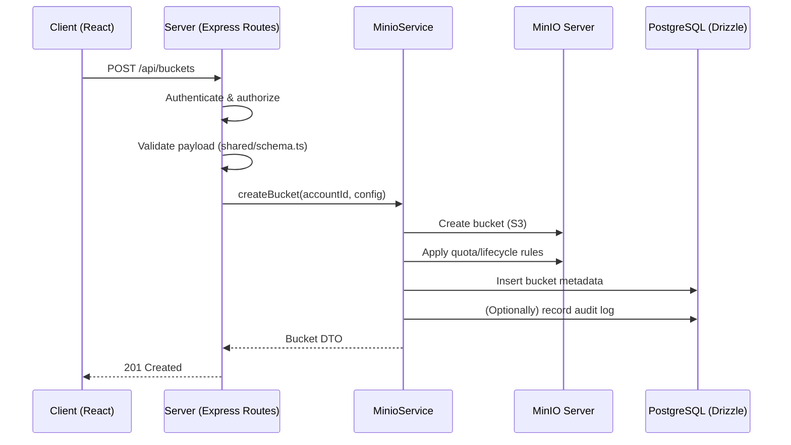
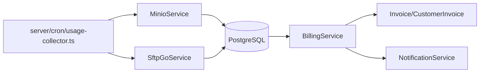

# Data Flow

This document describes how data moves through **PrimeCloud Pro V2**—from the React client, through the API and service layer, into PostgreSQL, and out to external infrastructure (MinIO, SFTPGo, SMTP, Auth providers). It is intended as a practical guide for developers implementing new features, debugging production issues, or reasoning about consistency between the “control plane” (metadata) and “storage plane” (object bytes).

Related docs:
- [architecture.md](architecture.md)
- Core schemas/types: [`shared/schema.ts`](../shared/schema.ts)
- API route builder: [`shared/routes.ts`](../shared/routes.ts)

---

## Mental Model: Three Planes

PrimeCloud Pro V2’s data flow is easiest to understand by separating concerns:

1. **Management Plane (API / Control Plane)**
   - The app’s REST API is responsible for authentication, authorization, validation, and metadata persistence.
   - Typical data: accounts, members, buckets (metadata), access keys, quotas, lifecycle rules, invoices, audit logs.

2. **Storage Plane (MinIO / SFTP)**
   - Large binary payloads (object bodies) are transferred **directly** to infrastructure.
   - The application provisions and governs access (buckets, users, credentials) but does not proxy object traffic.

3. **Background Processing (Cron / Aggregation)**
   - Periodic jobs pull usage metrics and generate billing artifacts.
   - Typical data: usage records, invoice generation, overdue checks, notification triggers.

---

## Key Building Blocks (Where Data Lives)

### Database (PostgreSQL via Drizzle)
PostgreSQL is the primary source of truth for business entities and metadata.

Common tables/types (see [`shared/schema.ts`](../shared/schema.ts)):
- `Account`, `AccountMember`, `Invitation`
- `Bucket`, `BucketPermission`, `AccessKey`
- `UsageRecord`, `Invoice`, `Customer`, `CustomerInvoice`
- `Notification`, `AuditLog`
- Object-level metadata helpers: `ObjectFavorite`, `ObjectTag`, `ObjectShare`

### External Systems
- **MinIO**: Object storage backend (S3 API). Stores object bytes and bucket configuration.
- **SFTPGo**: SFTP/FTP/WebDAV gateway. Provides user-based file transfer into storage.
- **SMTP**: outbound email for notifications.
- **Clerk/Replit Auth**: session and identity provider(s) used by the client/server auth integration.

---

## High-Level Request Path (Management Plane)

### Standard API lifecycle
1. **Client** calls the API using `apiRequest` (`client/src/lib/queryClient.ts`).
2. **Server routes** authenticate and authorize the request.
3. **Validation** occurs using Zod schemas/types from `shared/schema.ts`.
4. **Service layer** executes business logic and talks to infrastructure providers.
5. **Database** is updated (metadata persisted).
6. **Audit** entries are recorded for important events.
7. **Response** returns DTO-like JSON back to the client.

Key code locations:
- Client HTTP wrapper: [`client/src/lib/queryClient.ts`](../client/src/lib/queryClient.ts)
- Routes: `server/routes/*` (plus auth integration routes under `server/replit_integrations/auth`)
- Services: `server/services/*`
- Schemas: [`shared/schema.ts`](../shared/schema.ts)

---

## Example Flow: Create Bucket (+ Quota / Lifecycle)

A bucket creation is a “control-plane” operation that results in changes both in the database (metadata) and in MinIO (actual bucket + configuration).

**Important consistency note:** if infrastructure operations succeed but DB writes fail (or vice-versa), you can end up with drift. Prefer transaction-like behavior where possible, and ensure failures are audited.

Relevant code:
- MinIO orchestration: [`server/services/minio.service.ts`](../server/services/minio.service.ts)
- Audit logging: [`server/services/audit.service.ts`](../server/services/audit.service.ts)

---

## Storage Plane: Object Upload/Download

### Why objects bypass the application server
Object payloads can be large and high-throughput. The system is designed so that bytes flow directly between clients and MinIO/SFTPGo, while the app manages:
- bucket provisioning
- access keys / policies
- quota and lifecycle configuration
- metadata and sharing/favorites/tags in PostgreSQL

### S3 (MinIO) object flow
Typical flow:
1. User requests or already has S3 credentials (access/secret).
2. Client uses S3-compatible SDK to PUT/GET directly to MinIO.
3. App may store auxiliary metadata (favorites/tags/shares) in PostgreSQL.

Where object-related metadata appears in the codebase:
- Client bucket hooks/types: `client/src/hooks/use-buckets.ts` (e.g., `BucketObject`, tag/share/favorite DTOs)
- Shared schema types: `ObjectFavorite`, `ObjectTag`, `ObjectShare`

### SFTP (SFTPGo) flow
Typical flow:
1. App provisions an SFTPGo user and maps them to a storage location (virtual folders).
2. User connects via SFTP/FTP/WebDAV and transfers files.
3. Usage/transfer data can later be aggregated by cron jobs (depending on implementation).

Relevant code:
- SFTPGo orchestration: [`server/services/sftpgo.service.ts`](../server/services/sftpgo.service.ts)

---

## Background Processing: Usage Collection → Billing

Usage is collected asynchronously to avoid coupling billing to request latency and to ensure metrics reflect actual provider state.

### Pipeline overview
1. **Cron** triggers `collectUsageMetrics` (`server/cron/usage-collector.ts`).
2. **MinioService** queries storage backend for usage metrics (size, object stats, etc.).
3. **UsageRecord** rows are persisted (per account / time slice).
4. **BillingService** aggregates usage into monthly totals.
5. **Invoices** are generated and stored; overdue checks and notifications follow.

Key code locations:
- Cron entrypoints: [`server/cron/usage-collector.ts`](../server/cron/usage-collector.ts)
  - `collectUsageMetrics`
  - `checkOverdueInvoices`
  - `runMonthlyBilling`
  - `startCronJobs`, `stopCronJobs`
- Billing orchestration: [`server/services/billing.service.ts`](../server/services/billing.service.ts)

### What gets stored
- `UsageRecord`: the raw or semi-aggregated usage measurement used for billing.
- `Invoice` / `CustomerInvoice`: billing outputs.
- `AuditLog` / `Notification`: observability and user-facing signals.

---

## Audit & Notifications: Cross-Cutting Data Flows

### Audit logging
Security-sensitive and destructive operations should log an audit event (actor, severity, details). This is essential for debugging, compliance, and incident response.

Relevant code:
- [`server/services/audit.service.ts`](../server/services/audit.service.ts)
  - `AuditSeverity`, `AuditContext`, `AuditDetails`
  - `AuditService` used by other services/routes

**Recommended practice when adding new features:**
- log create/update/delete of critical resources (buckets, keys, members, billing actions)
- include enough context to reproduce “who did what” without exposing secrets

### Notifications
Notifications can be stored internally and/or sent via SMTP, typically triggered by:
- billing events (invoice created, overdue reminders)
- security events (credential changes)
- operational events (quota exceeded, failed jobs)

Relevant code:
- [`server/services/notification.service.ts`](../server/services/notification.service.ts)
- SMTP routes/handlers: [`server/routes/smtp.ts`](../server/routes/smtp.ts)

---

## Authentication & Session Data Flow

Identity comes from external auth (Clerk/Replit integration), then is bound to application entities (users/accounts/memberships) in PostgreSQL.

Key code locations:
- Auth routes/integration:
  - [`server/replit_integrations/auth/routes.ts`](../server/replit_integrations/auth/routes.ts)
  - [`server/replit_integrations/auth/replitAuth.ts`](../server/replit_integrations/auth/replitAuth.ts)
  - Storage adapter: [`server/replit_integrations/auth/storage.ts`](../server/replit_integrations/auth/storage.ts)

Typical flow:
1. Client obtains session/JWT from provider.
2. Server validates the session and resolves the user.
3. Server “upserts” the user record as needed.
4. Authorization decisions are made based on account membership/role stored in DB (see `AccountRole`, `AccountMember`).

---

## Module Dependency Direction (Layering Rules)

This codebase follows a layered dependency direction to keep shared code portable and avoid circular coupling:

- `client/src/pages` → `client/src/hooks`, `client/src/components`, `shared/*`
- `server/routes` → `server/services`, `shared/*`, `server/lib`
- `server/services` → `shared/*`, `server/lib`
- `server/cron` → `server/services`, `shared/*`
- `shared/*` → no internal dependencies (isomorphic core)
- `testsprite_tests` → exercises routes/services

**Rule of thumb:** if a module is “lower” in the stack, it should not import from a “higher” module.

---

## External Integrations Summary

| Integration | Purpose | Typical Direction | Auth Mechanism | Notes |
|---|---|---:|---|---|
| MinIO | Object storage backend | App ↔ MinIO (control), Client ↔ MinIO (data) | Access/Secret keys | App manages buckets/keys/quotas; clients transfer bytes directly |
| SFTPGo | SFTP/FTP/WebDAV gateway | App ↔ SFTPGo, User ↔ SFTPGo | Admin API credentials | App provisions users and folder mappings |
| SMTP | Email delivery | App → SMTP | Login/TLS | Used by notification/email flows |
| Clerk/Replit | Authentication | Client ↔ Provider, Server validates | JWT/session cookies | Server maps identity to local account/membership |

---

## Observability, Failure Modes, and Drift

### Common failure modes
- **MinIO down / unreachable**: bucket operations fail; should surface as 5xx and be audited.
- **Partial cron success**: some accounts’ usage recorded, others skipped; errors logged and retried next cycle.
- **DB write failure after infra success**: resource exists in MinIO/SFTPGo but not in DB (or vice versa).

### How the system mitigates issues
- **Audit logs** provide a chronological record of critical operations.
- **Cron retry-by-next-run** behavior is the default recovery mechanism for usage collection and invoice checks.
- **DB constraints and transactions** (where used) prevent inconsistent relational state for multi-table operations.

**Developer recommendation:** when adding workflows that touch both DB and infrastructure, explicitly define:
- the source of truth (DB vs provider) for each field
- compensating actions (cleanup on failure) or reconciliation strategies (periodic sync)

---

## Practical: Adding a New Data Flow (Checklist)

When implementing a new feature (e.g., “bucket archival”, “new billing dimension”, “custom domain workflow”), validate the full path:

1. **Schema**
   - Add/update types and Zod validation in `shared/schema.ts` (or related shared files).

2. **Route**
   - Add server route under `server/routes/*`.
   - Enforce authN/authZ and validate payload.

3. **Service**
   - Implement orchestration in `server/services/*`.
   - Keep provider-specific logic inside the service (MinIO/SFTPGo/SMTP).

4. **Persistence**
   - Persist state in PostgreSQL (Drizzle) and define relationships clearly.

5. **Audit**
   - Emit audit logs for security-sensitive or destructive actions.

6. **Client**
   - Add hook/API call patterns under `client/src/hooks/*` using `apiRequest`.
   - Update pages/components.

7. **Background jobs (if needed)**
   - If it’s periodic/async, integrate into `server/cron/usage-collector.ts` or a new cron module.

---

## Cross-References (Core Files)

- Shared schemas/types: [`shared/schema.ts`](../shared/schema.ts)
- Route URL utilities: [`shared/routes.ts`](../shared/routes.ts)
- Client request wrapper: [`client/src/lib/queryClient.ts`](../client/src/lib/queryClient.ts)
- MinIO orchestration: [`server/services/minio.service.ts`](../server/services/minio.service.ts)
- SFTPGo orchestration: [`server/services/sftpgo.service.ts`](../server/services/sftpgo.service.ts)
- Billing orchestration: [`server/services/billing.service.ts`](../server/services/billing.service.ts)
- Audit logging: [`server/services/audit.service.ts`](../server/services/audit.service.ts)
- Notifications: [`server/services/notification.service.ts`](../server/services/notification.service.ts)
- Cron jobs: [`server/cron/usage-collector.ts`](../server/cron/usage-collector.ts)
- SMTP route handlers: [`server/routes/smtp.ts`](../server/routes/smtp.ts)
- Auth integration: [`server/replit_integrations/auth/*`](../server/replit_integrations/auth)
